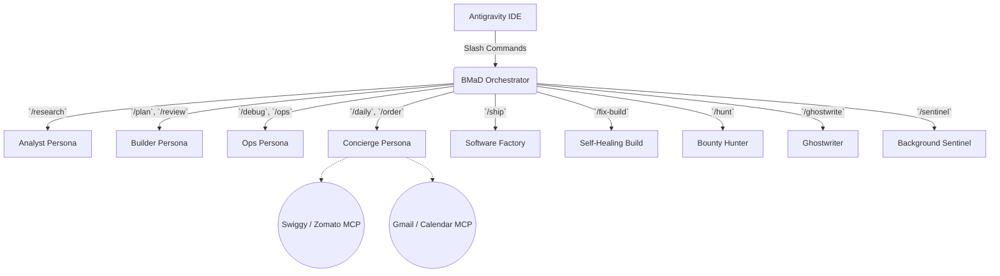
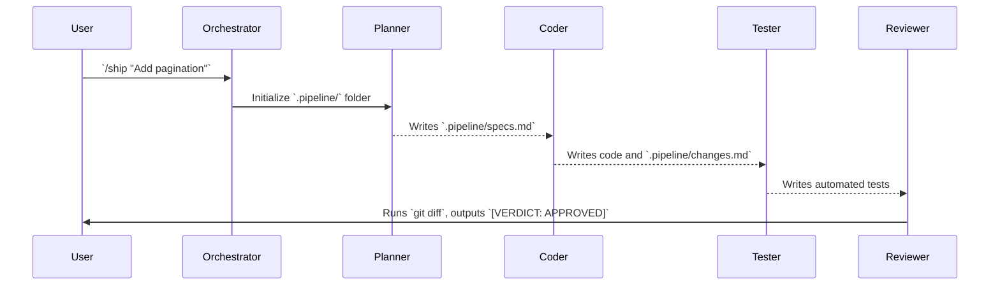

# Agentic-Skills Architecture

The `Agentic-Skills` repository is structured around a central **Orchestrator Pattern**. The IDE invokes the main configuration which reads `skills_index.json` to load custom skills, rules, and MCPs (Model Context Protocols).

## Directory Structure
- `AGENTS.md`: Global behavioral rules and constraints.
- `.mcp.json`: Global configuration for Model Context Protocol servers.
- `skills_index.json`: Manages the registration and discovery of all skills in this repository.
- `skills/`: The core directory containing isolated agent logic.
  - `skills/custom/`: Custom agent roles (Personas) and workflows.
  - `skills/custom-mcps/`: Custom built MCP servers (e.g., `food-mcp`).

## Core Architecture Diagram

## The Software Factory Pipeline

The `/ship` command initiates a highly strict closed-loop pipeline for feature delivery:

